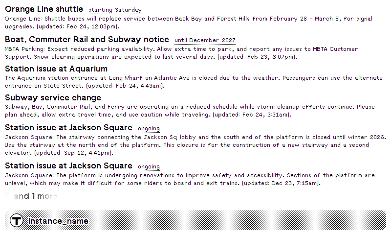
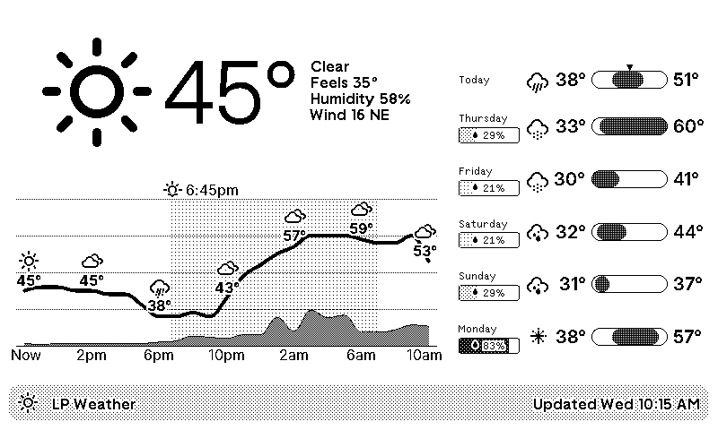

# trmnl-plugins

Plugins for [TRMNL](https://usetrmnl.com/), an e-ink display device.

## Plugins

### [MBTA Alerts](./plugins/mbta-alerts)

Displays service alerts from the Massachusetts Bay Transportation Authority (MBTA), filtered to subway and light rail.



### [Weather](./plugins/weather)

Displays current conditions, 24-hour temperature/precipitation chart, and multi-day forecast with weather icons.



## Plugin Structure

Each plugin directory uses the trmnlp `src/` layout:

```
plugins/<name>/
  .trmnlp.yml                 # local dev config
  fields.txt                  # API data field docs
  src/
    settings.yml              # API endpoint, refresh interval, metadata
    shared.liquid             # reusable Liquid templates
    full.liquid               # full screen layout
    half_horizontal.liquid
    half_vertical.liquid
    quadrant.liquid
```

## Local Development

### Live preview with trmnlp

```bash
cd plugins/<name>
trmnlp serve          # preview at http://localhost:4567
```

### Static build preview (no server required)

```bash
bash tools/build-preview.sh plugins/<name>              # build only
bash tools/build-preview.sh plugins/<name> --screenshot # build + screenshot to render.png
```

`build-preview.sh` runs `trmnlp build` (fetches live data, renders all layouts) then wraps each HTML file with the TRMNL screen shell so it renders correctly in any browser without needing `trmnlp serve` running.

To view the output, start a local HTTP server (required — `file://` URLs are blocked by browsers). Keep it running in the background between rebuilds:

```bash
cd plugins/<name>/_build && python -m http.server 8765
# open http://localhost:8765/full.html
```

The `--screenshot` flag opens `full.html` in Edge at 800×480, waits 3 seconds for Highcharts/fonts to render, saves `plugins/<name>/render.png`, and closes. Requires the HTTP server to be running on port 8765.

## Tools

- **[build-preview.sh](./tools/build-preview.sh)** - Build static HTML previews for any plugin (wraps `trmnlp build` output with TRMNL screen shell); `--screenshot` flag also captures `render.png` via playwright-cli
- **[Get-Trmnl-Image.ps1](./tools/Get-Trmnl-Image.ps1)** - Fetch current TRMNL screen image and display in Sixel format (black/white)
- **[Trmnl.Cli](./tools/Trmnl.Cli/)** - .NET 9 app that fetches and displays the current screen image in Sixel (full color)

`Get-Trmnl-Image.ps1` and `Trmnl.Cli` require `TRMNL_DEVICE_ID` and `TRMNL_DEVICE_API_KEY` environment variables (stored in 1Password item "trmnl").

## Resources

- [TRMNL Website](https://usetrmnl.com/)
- [TRMNL Documentation](https://docs.usetrmnl.com/)
- [trmnlp - Local Preview Tool](https://github.com/usetrmnl/trmnlp)
- [TRMNL Design System](https://trmnl.com/framework/docs)
