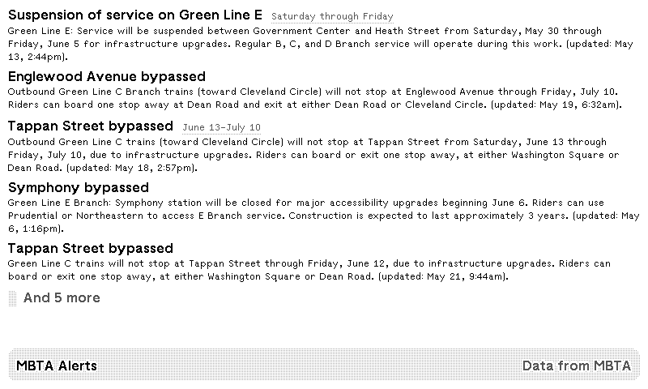
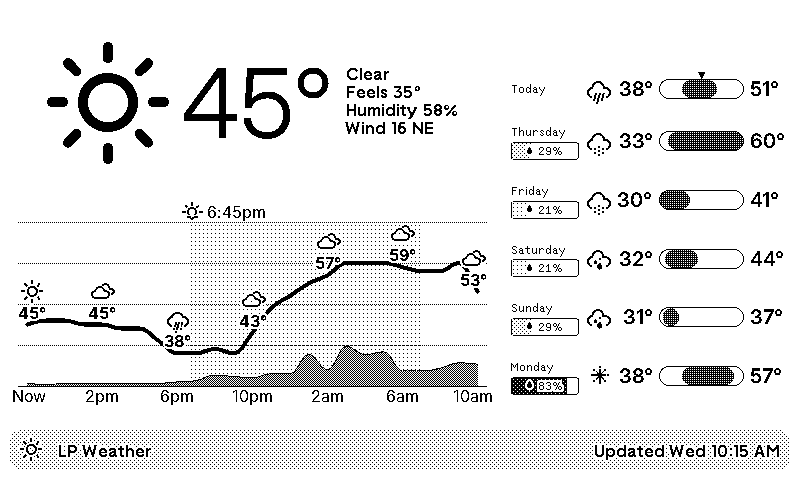

# trmnl-plugins

Plugins for [TRMNL](https://usetrmnl.com/), an e-ink display device.

## Plugins

### [MBTA Alerts](./plugins/mbta-alerts)

Displays service alerts from the Massachusetts Bay Transportation Authority (MBTA), filtered to subway and light rail.



### [Weather](./plugins/weather)

Displays current conditions, an hourly temperature/precipitation chart, and a multi-day forecast with weather icons.



## Backend API

The [Weather](./plugins/weather) plugin polls a custom ASP.NET Core backend in [`api/`](./api) that normalizes responses from upstream weather providers (Open-Meteo, Pirate Weather) into a uniform shape, caches them, and falls back to the other provider when one is unavailable.

Endpoints (base `https://trmnl-plugins-prod.lucasp.net`):

- `GET /api/v2/forecast?place=<city|postal code|lat,lon>` — normalized weather forecast; this is what the Weather plugin polls (see the [Weather plugin README](./plugins/weather/README.md#data-source) for all parameters)
- `GET /api/v1/forecast?latitude=<lat>&longitude=<lon>` — the previous version, frozen and kept alive for forked copies of the plugin that still poll it
- `GET /health` — liveness/readiness check
- `GET /metrics` — process-lifetime cache and provider counters

Design notes for the backend live in [`api/docs/`](./api/docs): the `place` input and the v1-to-v2 move ([place-input.md](./api/docs/place-input.md)), tracing and logging setup ([observability.md](./api/docs/observability.md)), geographic telemetry ([geographic-telemetry.md](./api/docs/geographic-telemetry.md)), and the legacy host proxy ([legacy-host-proxy.md](./api/docs/legacy-host-proxy.md)).

### Legacy host proxy

The API's first deployment lived on a different host that forked copies of the plugin still poll and
that cannot be updated. That host now runs a thin forwarding function from
[`legacy-proxy/`](./legacy-proxy) that relays `/api/v1/forecast` to the current backend byte-for-byte.
It is deliberately outside `api/` so editing it does not rebuild the main service, and it is not part
of `api/TrmnlApi.slnx`:

```bash
dotnet build legacy-proxy/src/TrmnlLegacyProxy/TrmnlLegacyProxy.csproj
dotnet test  legacy-proxy/tests/TrmnlLegacyProxy.Tests/TrmnlLegacyProxy.Tests.csproj
```

Build and test locally (.NET 10 SDK required):

```bash
dotnet build api/TrmnlApi.slnx
dotnet test api/TrmnlApi.slnx
dotnet run --project api/src/TrmnlApi    # http://localhost:8080
```

## Plugin Structure

Each plugin directory uses the trmnlp `src/` layout:

```
plugins/<name>/
  .trmnlp.yml                 # local dev config
  fields.txt                  # API data field docs (optional)
  assets/                     # cached sample API responses for offline preview (optional)
  bin/trmnlp                  # trmnlp launcher generated by `trmnlp init` (gem, else Docker)
  src/
    settings.yml              # API endpoint, refresh interval, metadata (must be in src/)
    shared.liquid             # reusable Liquid templates
    full.liquid               # full screen layout
    half_horizontal.liquid
    half_vertical.liquid
    quadrant.liquid
```

## Local Development

### Setup

```bash
bash tools/setup-env.sh    # Ruby + trmnlp, .NET SDK, .env
```

Idempotent and safe to re-run. Individual steps can be skipped with `--skip-ruby`, `--skip-dotnet`,
or `--skip-node`. `trmnl_preview` needs Ruby 3.4 or newer and a UTF-8 locale. Environment variables
are listed in `.env.example`; copy it to `.env` (gitignored) and fill in the values.

### Static build preview

```bash
bash tools/build-preview.sh plugins/<name>                                          # build all variants (og, x, x-portrait)
bash tools/build-preview.sh plugins/<name> --device x                               # TRMNL X only (landscape + portrait)
bash tools/build-preview.sh plugins/<name> --device x --orientation portrait         # X portrait only
bash tools/build-preview.sh plugins/<name> --screenshot                             # + screenshot all variants × all layouts
bash tools/build-preview.sh plugins/<name> --screenshot --1bit                      # + 1-bit B&W conversion
bash tools/build-preview.sh plugins/<name> --screenshot --device x --layout full    # screenshot X full only
bash tools/build-preview.sh plugins/<name> --screenshot --output /tmp/shots         # custom output directory
```

`build-preview.sh` runs `trmnlp build` (fetches live data, renders all layouts) then generates variant subdirectories under `_build/{og,x,x-portrait}/`, each with the correct TRMNL screen classes injected.

Flags:
- `--device <name>`: `og`, `x`, or `all` (default: `all`)
- `--orientation <value>`: `landscape`, `portrait`, or `all` (default: `all`). OG portrait is skipped.
- `--screenshot`: captures each variant × layout via playwright-cli (requires HTTP server on port 8765); output saved as `render-<variant>-<layout>.png`
- `--layout <name>`: layout to screenshot — `full`, `half_horizontal`, `half_vertical`, `quadrant`, or `all` (default: `all`)
- `--1bit`: converts screenshots to 1-bit black/white (no dithering) using ImageMagick (`magick`)
- `--output <dir>`: output directory for screenshots (default: `<plugin-dir>`); created if it doesn't exist

Viewport dimensions per layout (TRMNL OG): `full` 800×480 · `half_horizontal` 800×240 · `half_vertical` 400×480 · `quadrant` 400×240
Viewport dimensions per layout (TRMNL X): `full` 1040×780 · `half_horizontal` 1040×390 · `half_vertical` 520×780 · `quadrant` 520×390
Portrait swaps width and height (e.g., TRMNL X full becomes 780×1040).

To view the output, start a local HTTP server (required — `file://` URLs are blocked by browsers). Keep it running in the background between rebuilds:

```bash
cd plugins/<name>/_build && python -m http.server 8765
# open http://localhost:8765/og/full.html
# open http://localhost:8765/x/full.html
# open http://localhost:8765/x-portrait/full.html
```

### Fluid Mashup slots

TRMNL X offers Fluid Mashups, where a mashup cell — not the view — owns the size, so a view can land
in a slot no standalone layout has. `build-mashup-preview.sh` renders those slots:

```bash
bash tools/build-mashup-preview.sh plugins/<name>                                    # default cells: 3x1, 1x1, 1x3
bash tools/build-mashup-preview.sh plugins/<name> --cell 2x2 --cell 3x3              # pick cell sizes
bash tools/build-mashup-preview.sh plugins/<name> --screenshot --output _build/shots
```

Cell sizes are COLUMNS x ROWS (1–3 each), and `--cell 2x2:quadrant` overrides which view is placed
in the cell. Output goes to `_build/<variant>/mashup-<CxR>.html`. It calls `build-preview.sh` first
and takes the same `--device` / `--orientation` / `--screenshot` / `--1bit` / `--output` flags.

### Live preview with trmnlp

```bash
cd plugins/<name>
trmnlp serve          # preview at http://localhost:4567
```
## Tools

- **[setup-env.sh](./tools/setup-env.sh)** - One-shot dev environment setup (Ruby + trmnlp, .NET SDK, `.env`); idempotent, skip steps with `--skip-ruby` / `--skip-dotnet` / `--skip-node`
- **[push-plugin.sh](./tools/push-plugin.sh)** - Lint a plugin and push it to TRMNL; defaults to the staging copy of the plugin, `--env prod` targets the production one, `--dry-run` prints the settings overrides without pushing, `--no-lint` skips the lint step
- **[build-preview.sh](./tools/build-preview.sh)** - Build static HTML previews for all device variants (OG, X, X portrait) under `_build/{og,x,x-portrait}/`; `--screenshot` captures `render-<variant>-<layout>.png` via playwright-cli
- **[build-mashup-preview.sh](./tools/build-mashup-preview.sh)** - Wrap a built view in a Fluid Mashup cell (TRMNL X only) to see how it renders at a size no standalone layout has; `--cell 2x2` picks the cell size
- **[sync-framework-docs.sh](./tools/sync-framework-docs.sh)** - Regenerate and vendor the TRMNL framework design-system docs into the `trmnl-dev` skill
- **[Get-Trmnl-Image.ps1](./tools/Get-Trmnl-Image.ps1)** - Fetch current TRMNL screen image and display in Sixel format (black/white); saves timestamped PNG files
- **[Trmnl.Cli](./tools/Trmnl.Cli/)** - .NET 10 app that fetches and displays the current screen image in Sixel (full color)

`Get-Trmnl-Image.ps1` and `Trmnl.Cli` require `TRMNL_DEVICE_ID` and `TRMNL_DEVICE_API_KEY` environment variables (stored in 1Password item "trmnl").

## Resources

- [TRMNL Website](https://usetrmnl.com/)
- [TRMNL Documentation](https://docs.trmnl.com/)
- [trmnlp - Local Preview Tool](https://github.com/usetrmnl/trmnlp)
- [TRMNL Design System](https://trmnl.com/framework/docs)

## License

This project is licensed under the [MIT License](LICENSE).
