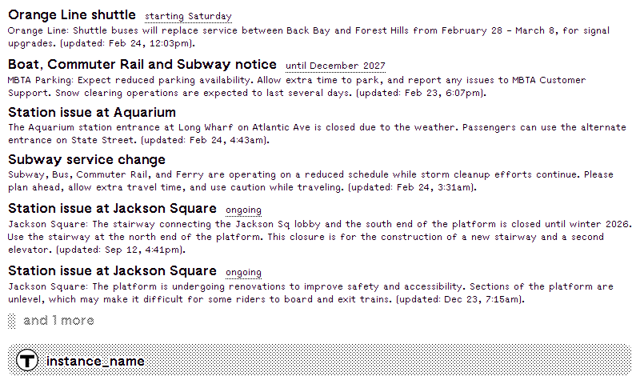

# MBTA Alerts

A [TRMNL](https://usetrmnl.com/) plugin that displays current service alerts from the Massachusetts Bay Transportation Authority (MBTA), filtered to subway and light rail routes.



## Features

- Displays active MBTA service alerts sorted by severity
- Filtered to subway (Heavy Rail) and light rail routes only
- Shows service effect, timeframe, alert details, and last updated time
- Gracefully handles empty state ("No current alerts")
- Automatically truncates long lists with "and N more" indicator

## Data Source

[MBTA V3 API](https://api-v3.mbta.com/) — free, no API key required.

## Setup

Install as a private plugin on [TRMNL](https://usetrmnl.com/). The plugin polls the MBTA API every 30 minutes.

## Development

### Local Preview

```bash
cd plugins/mbta-alerts
trmnlp serve    # http://localhost:4567
```

### API

The plugin polls the MBTA V3 API directly — no proxy needed:

```
https://api-v3.mbta.com/alerts?filter[route_type]=0,1&sort=-severity&fields[alert]=service_effect,timeframe,header,updated_at
```

- No API key required
- `filter[route_type]=0,1` — Light Rail (0) and Heavy Rail/Subway (1) only
- `sort=-severity` — most severe first
