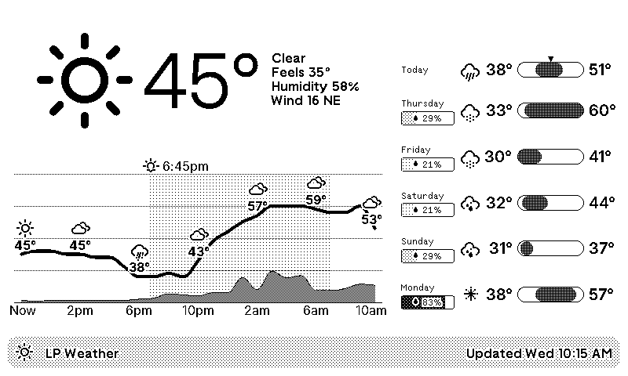

# Weather

A [TRMNL](https://usetrmnl.com/) plugin that displays current conditions, a 24-hour temperature chart, and a multi-day forecast with weather icons.



## Features

- Current conditions: temperature (°F and °C), feels like, humidity, wind speed/direction, weather icon
- 24-hour chart: temperature spline + precipitation probability bars (Highcharts)
- Weather icons on the hourly chart x-axis with day/night variants
- Sunrise and sunset times marked as dashed vertical lines on the chart
- Multi-day forecast with temperature range bars and weather icons
- Configurable latitude/longitude (defaults to Boston, MA)

## Setup

Install as a private plugin on [TRMNL](https://usetrmnl.com/). Configure your location by setting the **Latitude** and **Longitude** fields in the plugin settings. The plugin polls the API every 30 minutes.

## Data Source

Weather data comes from [Open-Meteo](https://open-meteo.com/) via a custom Azure Functions proxy (`api/` in this repo) that pre-processes WMO weather codes into condition labels and icon classes.

**Proxy URL**: `https://trmnl-plugins-api.azurewebsites.net/api/v1/forecast`

| Parameter | Required | Default | Description |
|-----------|----------|---------|-------------|
| `latitude` | yes | — | Location latitude |
| `longitude` | yes | — | Location longitude |
| `units` | no | `imperial` | `imperial` (°F, mph) or `metric` (°C, km/h) |
| `hours` | no | `25` | Number of hourly forecast entries (1–25) |
| `days` | no | `6` | Number of daily forecast entries (1–6) |

## Development

### Local Preview

```bash
cd plugins/weather
trmnlp serve    # http://localhost:4567
```

To test with cached data instead of hitting the live API, set a `data:` block in `.trmnlp.yml` pointing to a file in `assets/` (e.g. `assets/data-2026-02-24T18-30.json`). The filename encodes the `current.time` value used as "now" for the chart.

### External Dependencies

#### Highcharts

Used for the hourly temperature spline + precipitation bar chart.

- License: free for non-commercial use
- Self-hosted at `https://trmnlplugins.blob.core.windows.net/assets/highcharts.js` (avoids CDN rate limits in headless preview)

#### Erik Flowers Weather Icons

CSS icon font used for current conditions and chart labels.

- GitHub: https://github.com/erikflowers/weather-icons
- License: SIL OFL 1.1 (font), MIT (CSS)
- Self-hosted: `https://trmnlplugins.blob.core.windows.net/assets/weather-icons.woff2`
- Icon class (e.g. `wi wi-day-sunny`) is pre-computed by the API proxy, including day/night variants

#### Static Assets (Azure Blob Storage)

Self-hosted files live in the `trmnlplugins` storage account (resource group `trmnl-plugins`):

```bash
az storage blob upload \
  --account-name trmnlplugins \
  --container-name assets \
  --file <file> --name <name> \
  --content-type <type> \
  --auth-mode key
```
